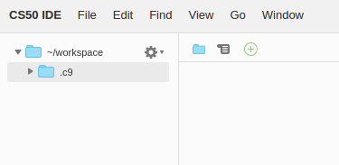

# CS50 IDE FAQs

## How can I open a file in the editor from a terminal tab?

If you want to open a file named `foo`, run `c9 open path/to/foo`.

## I closed the terminal underneath my editor by mistake. How do I get it back?

If the Console pane at the bottom is visible, you should be able to open a new terminal tab by clicking the  button atop that pane, and choosing **New Terminal**.


TIP: If you no longer see the Console pane, you can bring it back via **View > Console** or by hitting <kbd>F6</kbd>. You can also open a terminal in any other pane.

## Can I use a different editor?

Sure, if you are more familiar, you can run editors in the terminal such as `emacs`, `nano`, or `vim`.

## What's the best way to back up my work?

Choose **File > Download Project** to download `ide50.zip`, an archived file (in `.zip` format) of your workspace files.

## How to restore my work after backing it up?

If you backed up your work per [What's the best way to back up my work?](#whats-the-best-way-to-back-up-my-work), and you would like to restore it in a different (or same) workspace, upload `ide50.zip` to your workspace per [Uploading Files](/ide#uploading-files), then run the following commands in a terminal tab in your workspace:

```
$ unzip ide50.zip
$ mv ~/workspace/workspace/* ~/workspace/
$ rm -rf ide50.zip ~/workspace/workspace/
```


## What if I already have a Cloud9 account?

You can use your existing Cloud9 account to create a CS50 IDE workspace by [clicking this link](https://c9.io/open/?name=ide50&workspaceType=cs50&private=true), which will bring up a **Create a workspace** page with the default settings already selected.

NOTE: Be sure to check **Private**, under **Hosted Workspace**, if not checked.

All you'll need to do is create it! You can then access CS50 IDE from your Cloud9 dashboard, like you would access any other workspace.

## I registered for edX using my Facebook, Google, or Microsoft account, and can't log into the CS50 IDE. What should I do?

Unfortunately, edX's OpenID (which we use for authentication) doesn't support logging in with Facebook, Google, or Microsoft accounts yet. To get around this, for now, you should try restting your password (even though you may have never set any before) from your [Account Settings](https://courses.edx.org/account/settings) page on edX, then head to [cs50.io](https://cs50.io/) again and log in with the email associated with your Facebook, Google, or Microsoft account you use to log into edX, and the password you just set.

## I see a `.c9` folder appearing right under my `~/workspace` folder, that I haven't created. Is this normal?



Yes, this is totally normal. If curious, `~/workspace/.c9/` is used by Cloud9 IDE (and CS50 IDE) to hold some workspace settings, your undo history, and other metadata.

Generally, you shouldn't touch this folder or its contents. Files and folders whose names start with a dot (aka dot files) should be hidden by default. You may want to hide the `.c9` folder (along with any other dot files) by clicking the gear icon atop the file browser on the left and unchecking **Show Hidden Files**.


## What if my workspace runs out of disk space?

Old workspaces used to have less than 5GB of total disk space. This may be problematic particularly when running `update50` to get the latest updates since this may consume your disk space quota. We are hoping to address this better in the near future so that wouldn't be a concern for you, but in the meantime you can get a 5GB workspace by following these instructions:

1. Back up your files per [What's the best way to back up my work?](#whats-the-best-way-to-back-up-my-work).
1. From **CS50 IDE > Dashboard** click on **ide50**.
1. Click on the  icon next to  on the top-right corner. Alternatively, you may visit https://cs50.io/**\<your-username\>**/ide50/settings where **\<your-username\>** is your CS50 IDE username. Your CS50 IDE username should be part of the URL of your workspace, or you may run `username50` in a CS50 IDE terminal tab to get it.
1. If you are sure you have backed up your files, scroll down to the bottom of the page and click **Delete workspace**.
1. In the text field type **ide50** and click **Confirm**.
6. Go to [cs50.io](https://cs50.io/) and log in as usual.

This should automatically create a new 5GB workspace for you. You can confirm by clicking  on the top-right corner and checking the disk space. Please follow the instructions per [How to restore my work after backing it up?](#how-to-restore-my-work-after-backing-it-up) to upload your files to your new workspace. Let [sysadmins@cs50.harvard.edu](mailto:sysadmins@cs50.harvard.edu) know if you need further assistance!

## I'm getting an error that says `Looks like check50 (or submit50) isn't enabled for your account yet. Log into https://cs50.me/ in a browser, click Authorize Application, and re-run check50 (or submit50) here!` even after following these instructions. What should I do?

Go to https://github.com/check50/\<your-username\>/invitations and https://github.com/submit50/\<your-username\>/invitations, after replacing `<your-username>` with your actual GitHub username, and click **Accept invitation**, then try `check50` and/or `submit50` again. Let sysadmins@cs50.harvard.edu know if you need further assistance!

If curious why this happens, earlier the **Authorize Application** step was sufficient for adding your GitHub user as a collaborator with write access on your check50 and submit50 repositories that we automatically create for you, but GitHub updated their API recently to require users to accept invitations for repositories they're added to, so the **Authorize Application** step isn't sufficient any more, and you have to accept these invitations.

## My workspace doesn't look like David's from lecture and none of the `*50` commands work. What should I do?

Probably you're using a non-CS50 workspace. Follow these instructions to delete your current workspace, and create a CS50 workspace:

1. Back up your files per [What's the best way to back up my work?](#whats-the-best-way-to-back-up-my-work).
1. From **Cloud9 > Go To Your Dashboard** click on **ide50**.
1. Click on the  icon next to  on the top-right corner. Alternatively, you may visit https://cs50.io/**\<your-username\>**/ide50/settings where **\<your-username\>** is your CS50 IDE username. Your CS50 IDE username should be part of the URL.
1. If you are sure you have backed up your files, scroll down to the bottom of the page and click **Delete workspace**.
1. In the text field type **ide50** and click **Confirm**.
1. Go to [cs50.io](https://cs50.io/) and log in as usual.
1. If you're presented with the **Create a new workspace page**, be sure to click **Private** under **Hosted workspace**, and to select **Harvard's CS50** under **Choose a template**.
1. Follow the instructions per [How to restore my work after backing it up?](#how-to-restore-my-work-after-backing-it-up) to upload your files to your new workspace.
Let [sysadmins@cs50.harvard.edu](mailto:sysadmins@cs50.harvard.edu) know if you need further assistance!

## How to restore files that I have accidentally deleted?

Please follow the instructions at **[How do I recover a deleted file?](https://community.c9.io/t/how-do-i-recover-a-deleted-file/17/2)**. Let sysadmins@cs50.harvard.edu know if you need further assistance!
