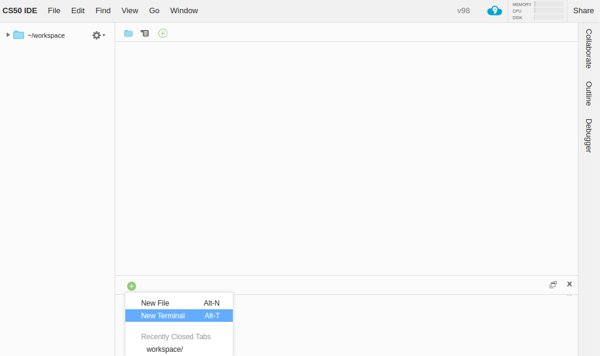

# CS50 IDE FAQs

## How can I open a file in the editor from a terminal tab?

If you want to open a file named `foo`, run `open path/to/foo`.

## I closed the terminal under my editor by mistake. How do I get it back?

If the Console pane at the bottom is visible, you should be able to open a new terminal tab by clicking the  button atop that pane, and choosing **New Terminal**.

TIP: If you no longer see the Console pane, you can bring it back via **View > Console** or by hitting <kbd>F6</kbd>. You can also open a terminal in any other pane.

## Can I use a different editor?

Sure, if you are more familiar, you can run editors in the terminal such as `emacs`, `nano`, or `vim`.

## What if I already have a AWS account?

The CS50 IDE isn't available yet to all AWS accounts.

## I'm getting an error that says `Looks like check50 (or submit50) isn't enabled for your account yet. Log into https://cs50.me/ in a browser, click Authorize Application, and re-run check50 (or submit50) here!` even after following these instructions. What should I do?

Go to https://github.com/check50/\<your-username\>/invitations and https://github.com/submit50/\<your-username\>/invitations, after replacing `<your-username>` with your actual GitHub username, and click **Accept invitation**, then try `check50` and/or `submit50` again. Let sysadmins@cs50.harvard.edu know if you need further assistance!

If curious why this happens, earlier the **Authorize Application** step was sufficient for adding your GitHub user as a collaborator with write access on your check50 and submit50 repositories that we automatically create for you, but GitHub updated their API recently to require users to accept invitations for repositories they're added to, so the **Authorize Application** step isn't sufficient any more, and you have to accept these invitations.

## How to restore files that I have accidentally deleted?

Please follow the instructions at **[How do I recover a deleted file?](https://community.c9.io/t/how-do-i-recover-a-deleted-file/17/2)**. Let sysadmins@cs50.harvard.edu know if you need further assistance!
