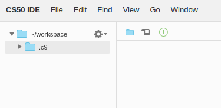
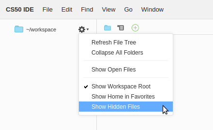

# CS50 IDE FAQs

## How can I open a file in the editor from a terminal tab?

If you want to open a file named `foo`, run `c9 open path/to/foo`.

## I closed the terminal underneath my editor by mistake. How do I get it back?

If the Console pane at the bottom is visible, you should be able to open a new terminal tab by clicking the  button atop that pane, and choosing **New Terminal**.

TIP: If you no longer see the Console pane, you can bring it back via **View > Console** or by hitting <kbd>F6</kbd>. You can also open a terminal in any other pane.

## Can I use a different editor?

Sure, if you are more familiar, you can run editors in the terminal such as `emacs`, `nano`, or `vim`.

## What's the best way to back up my work?

Choose **File > Download Project** to download an archived file (in `.zip` format) of your workspace files.

## What if I already have a Cloud9 account?

You can use your existing Cloud9 account to create a CS50 IDE workspace by [clicking this link](https://c9.io/open/?name=ide50&workspaceType=cs50&private=true), which will bring up a **Create a workspace** page with the default settings already selected.

NOTE: Be sure to check **Private**, under **Hosted Workspace**, if not checked.

All you'll need to do is create it! You can then access CS50 IDE from your Cloud9 dashboard, like you would access any other workspace.

## I registered for edX using my Facebook, Google, or Microsoft account, and can't log into the CS50 IDE. What should I do?

Unfortunately, edX's OpenID (which we use for authentication) doesn't support logging in with Facebook, Google, or Microsoft accounts yet. To get around this, for now, you should try restting your password (even though you may have never set any before) from your [Account Settings](https://courses.edx.org/account/settings) page on edX, then head to [cs50.io](https://cs50.io/) again and log in with the email associated with your Facebook, Google, or Microsoft account you use to log into edX, and the password you just set.

## I see a `.c9` folder appearing right under my `~/workspace` folder, that I haven't created. Is this normal?

Yes, this is totally normal. If curious, `~/workspace/.c9/` is used by Cloud9 IDE (and CS50 IDE) to hold some workspace settings, your undo history, and other metadata.

Generally, you shouldn't touch this folder or its contents. Files and folders whose names start with a dot (aka dot files) should be hidden by default. You may want to hide the `.c9` folder (along with any other dot files) by clicking the gear icon atop the file browser on the left and unchecking **Show Hidden Files**.

