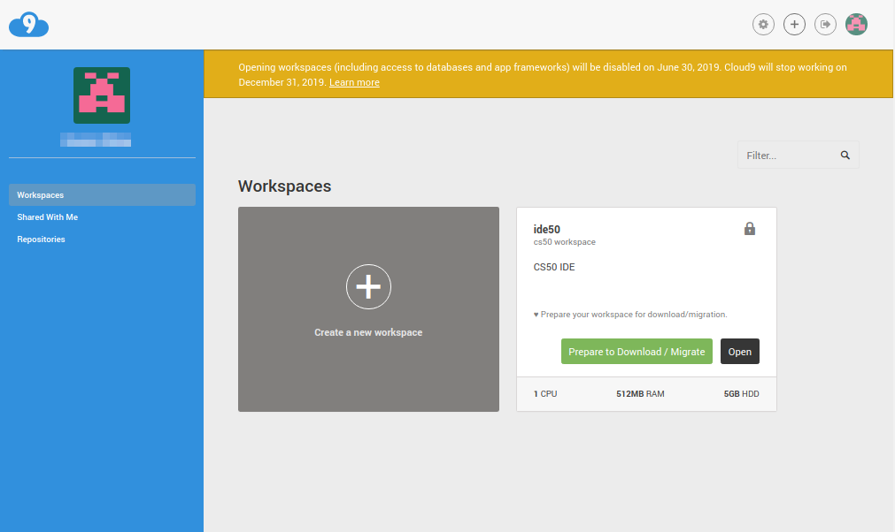
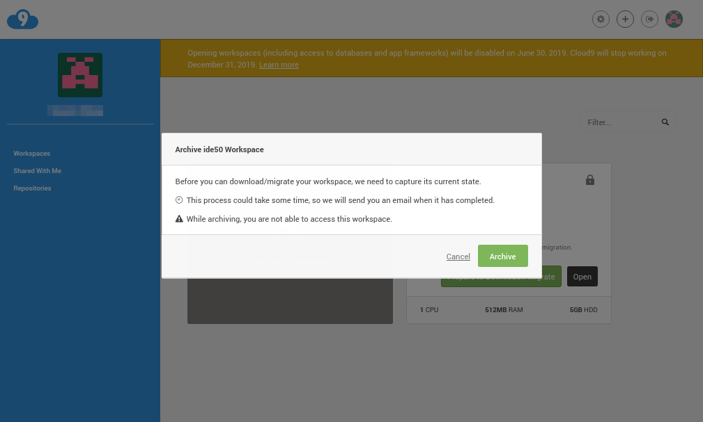
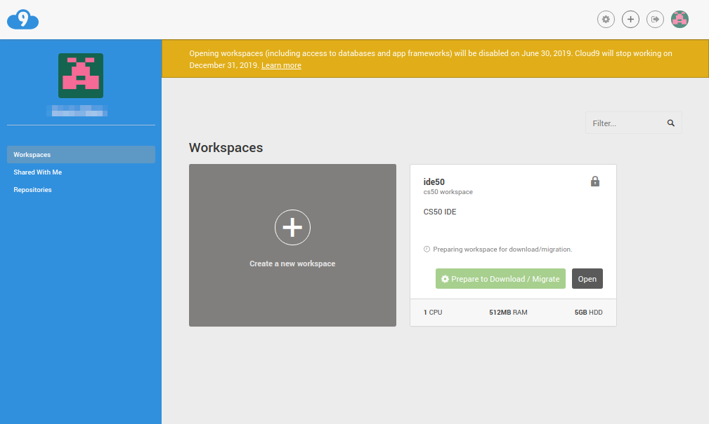
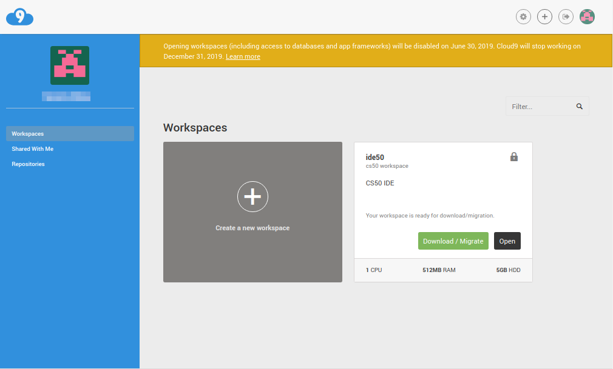
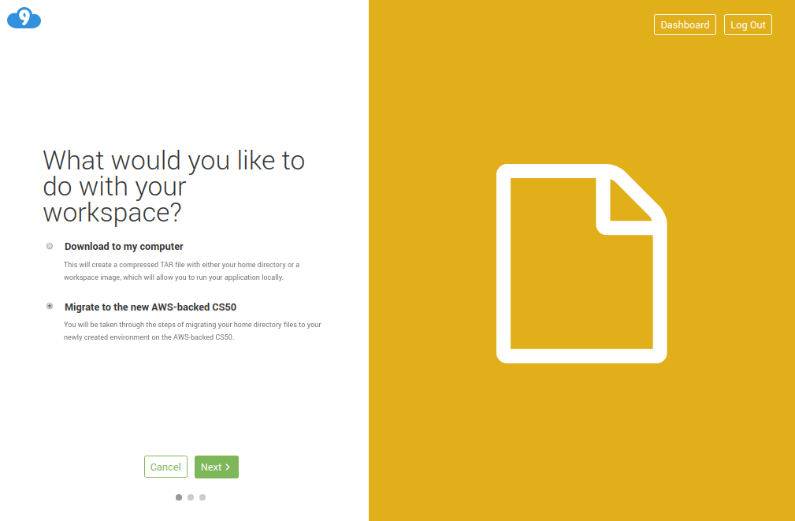
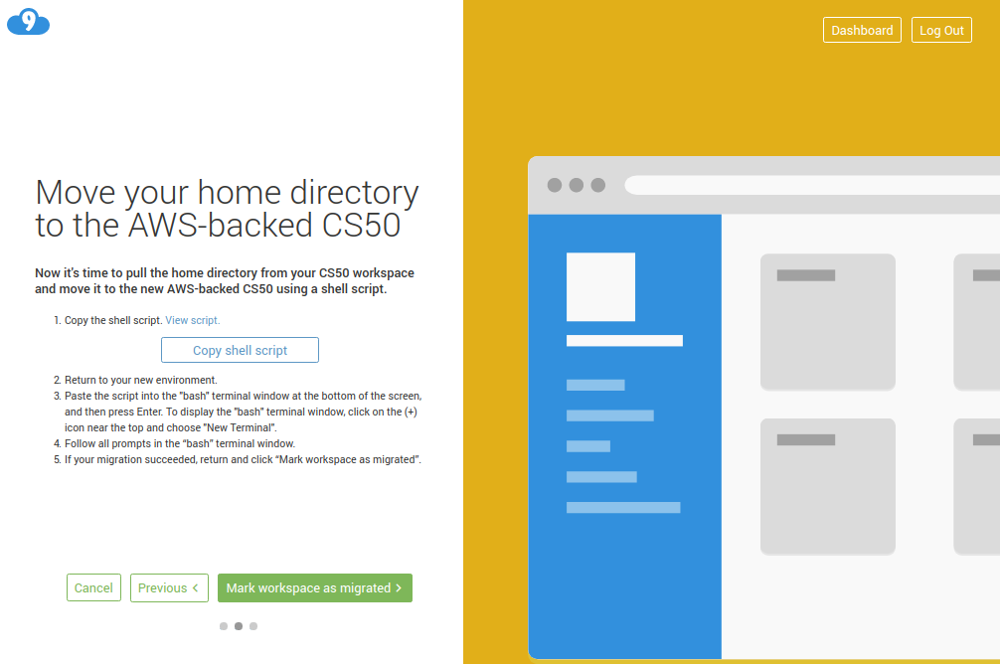
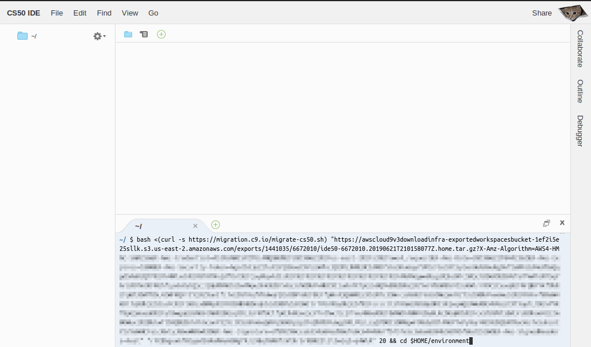

# Migrate Your CS50 IDE

CS50 is in the process of upgrading to a new-and-improved version of the IDE that requires that you download your files from the old (legacy) IDE and upload them to the new IDE. If you'd like to keep those files (e.g., your problem sets and/or final project), simply follow the instructions below. Please note that your files will be available for migration to the new IDE until December 31, 2019. After that date, you'll still be able to use the new IDE, but you won't be able to
migrate your files from the old IDE anymore.

1. Log into https://cs50.io

1. Find the box labeled ide50 and click Prepare Download / Migrate to initiate the process of archiving of your files and folders in the old IDE.

 

1. Confirm by clicking Archive when prompted.

 

1. Wait until the archive is ready (this may take several minutes). You should receive an email once it’s ready. 

 

1. Click Download / Migrate.

 

1. Choose Migrate to the new AWS-backed CS50 then click Next.

 

1. Click Copy shell script then Mark workspace as migrated.

 

1. Log into your new workspace with your GitHub account at https://ide.cs50.io (not https://cs50.io).

1. Click inside the terminal tab and press Ctrl + v or Cmd + v on your keyboard to paste the command you copied in step 7 then press Enter.

 

1. If prompted, press y then Enter on your keyboard. After a few moments, you should see the files and folders in the new IDE under the environment/ folder. You're welcome to drag or move (with mv) the contents of that folder elsewhere. 

 

Let sysadmins@cs50.harvard.edu know if you have any questions!
