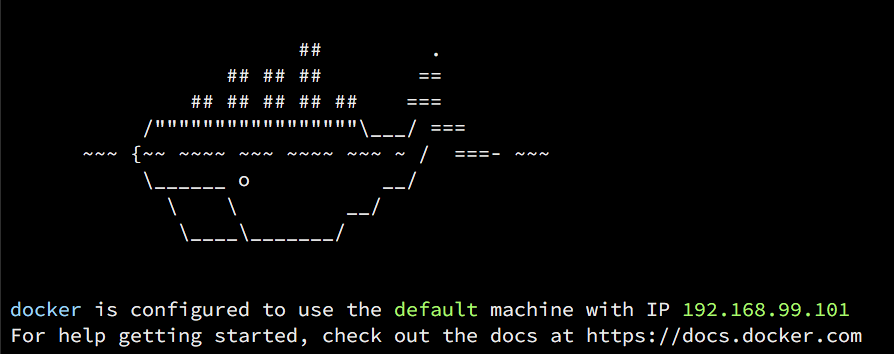

# CS50 IDE Offline

Normally, CS50 IDE requires a constant connection to the internet. This may not fit users with slow or unstable internet connections, or those who want to continue using the IDE offline for any number of reasons. The following instructions walk you through how to download and install the offline version of CS50 IDE.  Please note that the new offline IDE may be quite a large download (several GB).

## Installing

CS50 IDE Offline is a containerized app. We need to install a platform called [Docker](https://www.docker.com/what-docker) to run it.

### Linux

Follow the instructions for your Linux distribution to [install Docker Engine](https://docs.docker.com/engine/installation/linux/).

1. Open up a terminal window and run the following command to create a new CS50 IDE instance:

    ```
    docker run --privileged -e "IP=127.0.0.1" -e "PORT=8080" --name ide50 -d -p 5050:5050 -p 8080-8082:8080-8082 cs50/ide
    ```

1. Visit <http://localhost:5050/> in your favorite browser to access CS50 IDE.

### Mac

NOTE: If [these system requirements](https://docs.docker.com/docker-for-mac/install/#what-to-know-before-you-install) are not met, skip to [Docker Toolbox](#docker-toolbox).

1. Install [Docker for Mac](https://docs.docker.com/docker-for-mac/install/).
1. Open up a terminal window and run the following command to create a new CS50 IDE instance:

    ```
    docker run --privileged -e "IP=127.0.0.1" -e "PORT=8080" --name ide50 -d -p 5050:5050 -p 8080-8082:8080-8082 cs50/ide
    ```

1. Visit <http://localhost:5050/> in your favorite browser to access CS50 IDE.

### Windows

NOTE: If [these system requirements](https://docs.docker.com/docker-for-windows/install/#what-to-know-before-you-install) are not met, skip to [Docker Toolbox](#docker-toolbox).

1. Install [Docker for Windows](https://docs.docker.com/docker-for-windows/install/).
1. Open up a command prompt window and run the following command to create a new CS50 IDE instance:

    ```
    docker run --privileged -e "IP=127.0.0.1" -e "PORT=8080" --name ide50 -d -p 5050:5050 -p 8080-8082:8080-8082 cs50/ide
    ```

1. Visit <http://localhost:5050/> in your favorite browser to access CS50 IDE.

### Docker Toolbox

NOTE: You should only follow these instructions if you are a Windows or Mac user and the system requirements for [Windows](#windows) or [Mac](#mac), respectively, are not met.

1. Download and install **Docker Toolbox** for [Windows](https://docs.docker.com/toolbox/toolbox_install_windows/) or [Mac](https://docs.docker.com/toolbox/toolbox_install_mac/).

1. Open up the **Docker QuickStart Terminal** app that was installed on your computer. After a while, you should see something like the following, with a command prompt below it:
    

1. The IP stated in the screenshot above is the IP of the [Docker machine](https://docs.docker.com/machine/overview/). It may be different on your computer. You are going to use this IP to access your CS50 IDE, so you should record it.

1. Run the following command in the Docker QuickStart Terminal to create a new CS50 IDE instance:

    ```
    docker run --privileged -e "IP=$(docker-machine ip default)" -e "PORT=8080" --name ide50 -d -p 5050:5050 -p 8080-8082:8080-8082 cs50/ide
    ```

1. Visit <http://<machine-ip>:5050/>, in your favorite browser, to access CS50 IDE, after replacing `<machine-ip>` with the actual IP for the Docker machine.

TIP: If you ever forgot or lost the IP of the Docker machine, you should be able to get it back by running `docker-machine ip default` in the Docker QuickStart Terminal.


## Downloading the Docker Image

When you execute the `docker run` step above, the latest IDE base image should be automatically downloaded for you. If you have a very slow or unstable internet connection, the download might fail. The following steps describe how you can download the Docker image seaparately and load it into your Docker setup:

1. [Download](http://mirror.cs50.net/ide/ide.tar?download) the image (or [torrent-download](http://mirror.cs50.net/ide/ide.tar?torrent) if you prefer).
1. Open up a terminal window or Docker QuickStart Terminal and run

    ```
    docker load < path/to/ide.tar
    ```
1. Try running the `docker run` step from the set of instructions that you followed above again.


## Managing the IDE

### Starting the IDE

If you can't access your CS50 IDE (e.g., after restarting your computer), it's possibly because it's stopped. To start it back, open up a terminal window (if using [Mac](#mac)), a command prompt (if using *<<windows>>*), or Docker QuickStart Terminal (if using [Docker Toolbox](#docker-toolbox), and run the following command:

```
docker start ide50
```

### Restarting

Normally, you shouldn't need to restart the IDE, but if you ever wanted to open up a terminal window (if using [Mac](#mac)), a command prompt (if using [Windows](#windows)) or Docker QuickStart Terminal (if using [Docker Toolbox](#docker-toolbox)), and run the following command:

```
docker restart ide50
```

### Stopping

To stop CS50 IDE, open up a terminal window (if using [Mac](#mac)), a command prompt (if using [Windows](#windows)) or Docker QuickStart Terminal (if using [Docker Toolbox](#docker-toolbox)), and run the following command:

```
docker stop ide50
```

### Removing

To remove your CS50 IDE instance, open up a terminal window (if using [Mac](#mac)), a command prompt (if using [Windows](#windows)) or Docker QuickStart Terminal (if using [Docker Toolbox](#docker-toolbox)), and run the following command:

```
docker rm ide50
```

## Where to Go Next?

Read up on on how to use [CS50 IDE](/ide/online/) itself!
