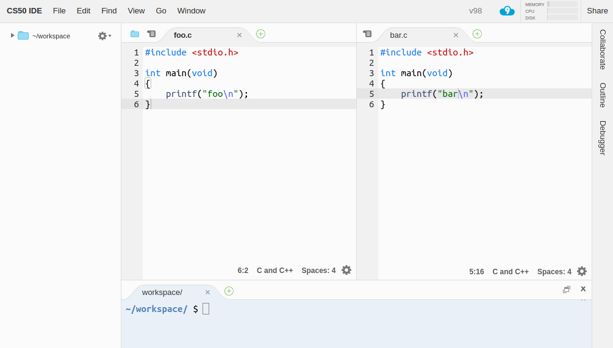

# Online 

* [FAQs](/ide/faqs.md)
* [Offline](/ide/offline.md)

## Introduction

CS50 IDE is a cloud-based Integrated Development Environment powered by [AWS Cloud9](https://aws.amazon.com/cloud9/) that features a cloud-based Ubuntu environment, a browser-based editor that supports syntax highlighting and word completion, a GUI-based GDB debugging, themes, customizable layouts, keyboard shortcuts, and many more features. Since it's cloud-based, you can continue working on your problem sets even if you use a different computer!

## Getting Started

1. If you don't already have one, create a GitHub account [here](https://github.com/join).
1. Visit [ide.cs50.io](https://ide.cs50.io).
1. Click Sign in with GitHub then login into your GitHub account and authorize the CS50 IDE GitHub app if prompted.
1. Once you log in, you will automatically be forwarded to CS50 IDE! Hereafter, you may simply return to [ide.cs50.io](https://ide.cs50.io/) to log in and return to CS50 IDE, where all your files and settings are preserved.

## Working with Files

### Creating Files

There are multiple ways to create a new file in CS50 IDE:

- Click **File > New File**.
- Click on the little  button atop any of the open panes and choose **New File** to open a blank file in that particular pane.
- From the file browser on the left, right-click or control-click on a directory and choose **New File** from the menu to create a blank file inside that directory, then double-click that file to open it.
- Press <kbd>Alt</kbd> + <kbd>N</kbd> (on a PC) or <kbd>⌘</kbd> + <kbd>N</kbd> (on a Mac).

### Saving Files

When a file is open in a tab and you have some unsaved changes, CS50 IDE will show a red dot atop that tab, until you save your changes. Probably the easiest way to save a file is to press <kbd>Ctrl</kbd> + <kbd>S</kbd> (on a PC) or <kbd>⌘</kbd> + <kbd>S</kbd> (on a Mac), but you can also achieve the same by clicking **File > Save** (or **File > Save As...** if you want to save that as a new file), while you're working on that file.

### Downloading Files

To download a file from your workspace to your local computer, simply navigate to the location of that file, in the file browser on the left, right-click on that file's name, and choose **Download**.

To download all files in your home folder (i.e., `~/`), click **File > Download Project**.

### Uploading Files

To upload a file from your local computer to your workspace:

1. Select a directory where you want your files to get uploaded into, by clicking on that directory in the file browser on the left. By default, this is going to be your `~/` directory.
1. Click **File > Upload Local Files...**, then choose either **Select files** or **Select folder**, depending on what you want to upload.

### File Revision History

While working on a file, you can easily undo changes by clicking **Edit > Undo** or by pressing <kbd>Ctrl</kbd> + <kbd>Z</kbd> (on a PC) or <kbd>⌘</kbd> + <kbd>Z</kbd> on your keyboard. Similarly, you can redo changes by clicking **Edit > Redo** or by pressing <kbd>Ctrl</kbd> + <kbd>Shift</kbd> + <kbd>Z</kbd>.

The CS50 IDE also keeps track of file revisions, in case you want to toggle between file revisions, without having to undo or redo many times. You can show the whole file revision history by clicking **File > Show File Revision History**, which will show a timeline similar to the following, on which you can click to jump to a particular version.

## Working with Terminals

Terminals allow you to interact with the underlying Ubuntu environment of CS50 IDE, using textual commands, to do all sorts of things, such as creating, copying, or moving files, compiling and running your programs, and more.

### Opening New Terminals

When CS50 IDE first starts, there should be a terminal tab open at the bottom by default. You can also open a new terminal tab in that or any other pane of your choice by clicking the  button atop that pane, and choosing **New Terminal**. Alternatively, you may just hit <kbd>Alt</kbd> + <kbd>T</kbd> (on a PC) or <kbd>Option</kbd> + <kbd>T</kbd> (on a Mac).

By default, the current working directory (CWD) in a new terminal is your `~/` directory. You can always navigate to your desired directory using `cd path/to/directory`. To open a terminal in a different directory, navigate to that directory in your file browser, right-click (on a PC) or Ctrl-click (on a Mac) on the directory's name, and choose **Open Terminal Here**.

### Copying and Pasting

You will probably need to copy and paste commands into terminal tabs to run them. By default, copying and pasting via menus will work inside CS50 IDE, but you may have to grant the IDE permission to see the contents of your clipboard first. You can either choose to grant the IDE that permission or use your keyboard to copy and paste instead by pressing <kbd>Ctrl</kbd> + <kbd>C</kbd> and <kbd>Ctrl</kbd> + <kbd>V</kbd>> (on a PC) or <kbd>⌘</kbd> + <kbd>C</kbd> and <kbd>⌘</kbd> + <kbd>V</kbd> (on a Mac).

### Command History

You will be often using the same commands over and over. Whether you don't remember a particular command, or too lazy to type it again, you can leverage the command history that is kept by your terminals. You can scroll up and down through the list of commands by pressing your keyboard's up or down arrow.

Additionally, you can search for a particular command by pressing <kbd>Ctrl</kbd> + <kbd>R</kbd> (on a PC) or <kbd>⌘</kbd> + <kbd>R</kbd> (on a Mac), then pressing the same key combination again to scroll through the matches, and finally <kbd>Tab</kbd> to select a particular match to modify it before running or <kbd>Enter</kbd> if you want to run it directly.

### Clearing Terminals

From time to time you will need to clear your terminal so that it's easier to see what you're doing. There are two main ways to do that

1. Press <kbd>Ctrl</kbd> + <kbd>L</kbd> (on a PC) or <kbd>⌘</kbd> + <kbd>L</kbd> (on a Mac). This doesn't actually clear the terminal, but rather just scrolls down, so you can always scroll back up and see what got cleared if you want to.
1. Press <kbd>Ctrl</kbd> + <kbd>K</kbd> (on a PC) or <kbd>⌘</kbd> + <kbd>K</kbd> (on a Mac). This actually clears the terminal; you won't be able to scroll back up and see what got cleared.

### Troubleshooting

If you want to force a program to quit, for example because it's stuck in an infinite loop, press <kbd>Ctrl</kbd> + <kbd>C</kbd> (on a PC) or <kbd>⌘</kbd> + <kbd>C</kbd> (on a Mac). It may take several seconds for the program to respond.

As a last resort, in case the program won't stop, you might need to forcibly kill it. Perhaps the easiest way to do that is to just close the terminal tab, clicking *Close* when prompted, and opening a new one.

## Layouts and Themes

### Layouts

The CS50 IDE is very customizable when it comes to laying out panes and tabs. You could very easily split a pane horizontally or vertically, by right-clicking (on a PC) or Ctrl-clicking (on a Mac) somewhere next to the  button atop the pane you want to split and choosing **Split Pane in Two Rows** or **Split Pane in Two Columns**.

You could also move tabs between different panes by dragging and dropping a tab to the targeted pane or even to somewhere you want a new pane with that tab to be created.

### Themes

By default a theme called **Cloud9 Day** is selected, but if you prefer a dark theme, you can select it via **View > Dark Mode**.

### Presentation Mode

CS50 IDE also provides **Presentation Mode** in which the user interface is even more simplified and font sizes are larger. You can toggle that mode via **View > Presentation Mode**.

## Sharing Your Workspace

### Adding a Member to Your Workspace

1. Head to your IDE and click **Share** on the top-right corner.

    

1. Under **Invite members**, type in the GitHub username of the user you'd like to share your IDE with and click **Invite**.

    

1. Copy your IDE's link and share it with that user. They should now have access to your IDE.

    

### Removing a Member to Your Workspace

1. Head to your IDE and click Share on the top-right corner.

    

1. Under **Who has access** find the GitHub username of the user you'd like to remove from your IDE.

    

1. Click the **x** button to the right of that username. They should no longer have access to your IDE.

    

## Reporting Problems

If having any problems with CS50 IDE, please contact <sysadmins@cs50.harvard.edu> with all the necessary information about the problem, and how to replicate it, attaching screenshot(s) if need be!
