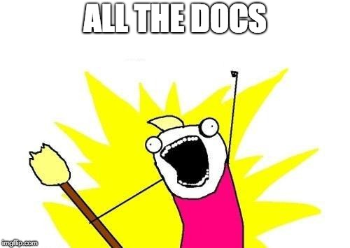

.. title:: Home

.. toctree::
   :caption: APIs
   :hidden:
   :maxdepth: 1

   Dining <api/dining>
   Map <api/map>

.. toctree::
   :caption: Command-Line Tools
   :hidden:
   :maxdepth: 1

   check50 <https://cs50.readthedocs.io/projects/check50/>
   cli50
   compare50 <https://cs50.readthedocs.io/projects/compare50/>
   render50
   style50
   submit50

.. toctree::
   :caption: Docker Images
   :hidden:
   :maxdepth: 1

   cs50/check
   cs50/cli
   cs50/codespace
   cs50/server

.. toctree::
   :caption: Libraries
   :hidden:
   :maxdepth: 1
   :name: libraries

   check50 <https://cs50.readthedocs.io/projects/check50/>
   compare50 <https://cs50.readthedocs.io/projects/compare50/>
   cs50 <libraries/cs50/index>
   lib50 <https://cs50.readthedocs.io/projects/lib50/>

.. toctree::
   :caption: Style Guides
   :hidden:
   :maxdepth: 1

   C <style/c>
   Python <https://peps.python.org/pep-0008/>

.. toctree::
   :caption: Themes
   :hidden:
   :maxdepth: 1

   Jekyll <themes/jekyll>

.. toctree::
   :caption: Third-Party Software
   :hidden:
   :maxdepth: 1

   docker
   github
   heroku
   pip
   python
   terminal
   zoom

.. toctree::
   :caption: Web Apps
   :hidden:
   :maxdepth: 1

   certificates.cs50.io
   forms.cs50.io
   id.cs50.io
   manual.cs50.io
   render.cs50.io
   time.cs50.io
   vault.cs50.io
   video.cs50.io
   cs50.dev

